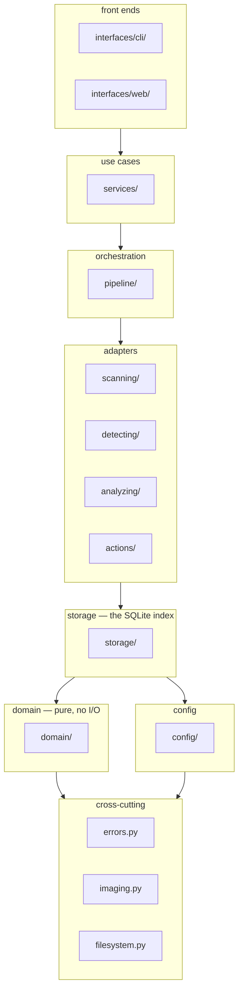
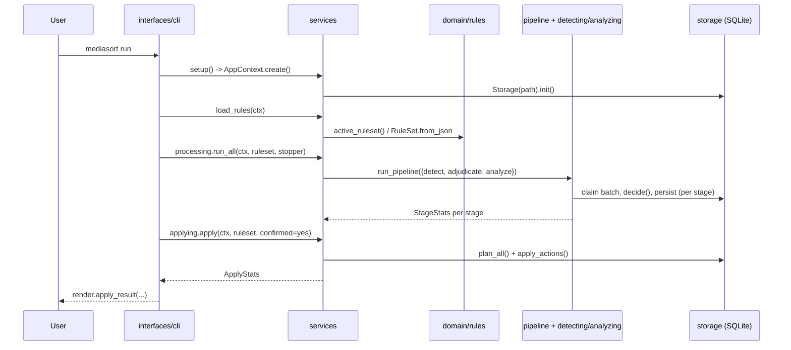

# Architecture

A guided tour of `mediasort/`: what each package is for, why it is separate
from its neighbors, and how a request actually flows through the code. For
*what the software does* — YOLO, Ollama, rules, the review flow — see
[CONCEPTS.md](CONCEPTS.md); this document is about where that behavior lives.

## The layering, in one picture

`mediasort/__init__.py` states the rule the whole codebase follows: each
layer may only import from the ones above it in this list.



Two consequences fall out of this, and both are enforced by convention (there
is no linter rule for it — the layering is a discipline the code follows,
visible by grepping imports):

- **`domain/` has zero dependencies.** What a rule means and what a set of
  detections decides is plain Python over plain values — testable without a
  database, a GPU, or a network call, and it is where most of the actual
  *policy* of the tool lives.
- **Nothing below `services/` knows it is a CLI or a web server.** A service
  function takes an `AppContext` and returns plain data (dataclasses, dicts).
  `interfaces/cli` turns that into a Rich table; `interfaces/web` turns the
  identical call into JSON. Neither front end contains logic the other one
  would have to duplicate — that is the whole reason `services/` exists as
  its own layer instead of living inside the CLI.

## Module map

### `errors.py`
Every exception the application raises on purpose, in one file, so a caller
can catch by *intent* ("the configuration is wrong") without importing
whichever module happens to detect the problem. Anything that is not a
`MediaSortError` is a bug and is meant to crash with a traceback — that
distinction is what lets `interfaces/web/server.py` turn one into a 400 and
let the other one become a 500 with a logged stack trace.

### `imaging.py`, `filesystem.py`
`imaging.py` is the only module that imports Pillow — decoding, EXIF
orientation, HEIC support and the decompression-bomb guard are handled once
here instead of separately in the scanner, the detector and the vision
client, each of which needs pixels for a different reason.

`filesystem.py` is every place the tool is allowed to create, move or delete
a file, expressed as intents (`copy`, `move`, `remove`) rather than scattered
`shutil` calls — which makes this one file the complete audit surface for
"what can touch a byte on disk." There is deliberately no symlink/hardlink
option: an action's name (`copy`, `move`, `delete`) *is* what it does, with
no second setting to check.

### `domain/` — the pure core
No I/O, no third-party imports, no environment reads. Four pieces:

- **`detection.py`** — the `Detection` value type (one YOLO box), plus the
  `video` pseudo-class: a video is never decoded, so a rule matches one by
  file extension instead, and this module is where that fiction is defined.
- **`decision.py`** — `decide()`, the entire decision engine: given
  detections and a `RuleSet`, resolve each class's confidence band via
  `RuleSet.class_bands()` and return which rule matched and whether the
  image needs a second opinion. Deliberately knows nothing about cats,
  dogs, or folders.
- **`adjudication.py`** — the second opinion as data (`Adjudication`,
  `present`/`absent`/`unsure`) and the pure function `adjudicated()` that
  folds a verdict back into a detection list before `decide()` runs again.
- **`rules/`** — split into `conditions.py` (the condition tree: `HasClass`,
  `AllOf`, `Not`, …, each a small `Condition` implementing `matches` /
  `to_json` / `describe`) and `ruleset.py` (`Rule`, `RuleSet`, priority
  order, the always-present doubt rule, JSON (de)serialization). Reading or
  writing the rules *file* is storage's job, not this package's — keeping
  I/O out of `domain/` is why `RuleSet.starter([...])` can be unit-tested
  with no filesystem in sight.

### `config/`
- **`sections.py`** — the shape: one frozen dataclass per concern
  (`DetectSettings`, `AnalyzeSettings`, `LibrarySettings`, …), each handed
  only the fields a module has any business reading.
- **`env.py`** — assembles a `Settings` from three layers: built-in
  defaults, the environment (including a project `.env`), and the runtime
  overlay. `source_of()` reports which layer won, which is what `config
  show`/`doctor` and the web UI's field badges are reading.
- **`dotenv.py`** — the `.env` reader: finds the nearest one by walking up
  from the working directory, parses `KEY=value` lines. Not a shell — no
  interpolation, no multi-line values.
- **`overrides.py`** — the runtime overlay (`data/settings.json`): the small,
  explicitly-enumerated set of settings the web UI and `mediasort config
  set` can change without editing `.env` or restarting. Validates before
  writing, so a rejected edit never corrupts the file.

### `storage/` — the index
One SQLite database, one repository class per table, wired together by the
`Storage` facade (`storage/__init__.py`). See [the index](#the-index) below
for the schema and why it is shaped this way.

- **`engine.py`** — connection and transaction management: one connection
  per thread, `write()` as a re-entrant context manager so composing several
  repository calls into one atomic transaction is just nesting them, and the
  schema-version check that refuses to open an index from an incompatible
  build.
- **`schema.py`**, **`state.py`** — the table definitions, and the small
  `Stage`/`PENDING`/`RUNNING`/`DONE`/`ERROR`/`SKIPPED` vocabulary every
  stage's state column is built from.
- **`images.py`** — the big one: claiming batches of work per stage,
  recording scan results, the pending/in-flight queries every stage and the
  CLI's progress bars read.
- **`detections.py`**, **`adjudications.py`**, **`metadata.py`**,
  **`links.py`**, **`activity.py`** — one table each, replaced wholesale
  per image on each (re)run rather than diffed.
- **`results.py`** — the one place that writes an evidence table *and* the
  image row's derived decision in the same transaction, so a crash mid-write
  never leaves the two disagreeing.
- **`reporting.py`** — cross-table read queries (progress counts, tallies,
  duplicates, search) that don't belong to any single repository.
- **`rules_store.py`** — reads and writes the rules *file* (JSON on disk),
  as distinct from the rules engine itself in `domain/rules`.

### `scanning/`
`walker.py` decides which files on disk count as the library (extensions,
excluded/hidden directories, never walking into the tool's own output);
`scanner.py` does the incremental bookkeeping — cheap size/mtime check
first, only hashing and probing what actually changed, batching writes so a
300k-file scan does not hit SQLite once per file.

### `detecting/`, `analyzing/` — the two inference adapters
Both are adapters over a heavy, optional dependency (`ultralytics`+`torch`
for one, an HTTP call to Ollama for the other), and both import that
dependency lazily, inside a function — so any command that never touches
detection or the vision model starts instantly, without paying to import
`torch`.

- **`detecting/detector.py`** — one loaded YOLO model, batched inference,
  decode-on-a-thread-pool so the GPU is never left idle between batches.
  `availability.py` is the cheap "can this even run here?" probe front ends
  call before committing to anything expensive.
- **`analyzing/client.py`** — `OllamaClient`, the transport: build a
  request, resolve a bare model name to the tag actually installed, survive
  a server still starting. **`contract.py`** is the pure half — the
  prompts, the JSON schemas built dynamically from whatever classes the
  rules mention, and parsing/salvaging a reply. Splitting transport from
  contract means the prompt and schema logic is testable with no HTTP
  server in the loop.

### `actions/` — what a matched rule leads to
- **`base.py`** — the `Action` interface (`plan` then `execute`, planning
  first so `--dry-run` is the exact same code path as a real run) and
  `NameAllocator`, which hands out collision-free output paths.
- **`builtin.py`** — the four shipped actions: `copy`, `move`, `delete`,
  `ignore`. See [CONCEPTS.md](CONCEPTS.md#the-actions) for what each does.
- **`planner.py`** — `plan_all()`: turns every categorized index row into a
  list of `PlannedAction`s, including the doubt-rule mirror into the review
  folder where it applies.
- **`executor.py`** — `apply_actions()`: prunes output that no longer
  belongs, then executes the plan, batching the resulting link/activity
  rows so a large apply run doesn't write to SQLite once per file.
- **`registry.py`** — `ActionRegistry`, a name→`Action` lookup shared by
  rule validation, the CLI's `rules actions`, and the web UI's picker, so
  none of them hardcodes the list. Adding a fifth action (`tag`, `upload`,
  …) means writing one class and registering it — nothing else changes.

### `pipeline/` — driving the heavy stages
- **`ports.py`** — `DetectorEngine` / `AdjudicatorEngine` / `VisionEngine`,
  declared as `Protocol`s. This is the one file that lets `pipeline/`
  import neither `ultralytics` nor `requests`: a test can drive a whole
  stage with a dozen lines of fake, and swapping an engine for a different
  one is a change in `services/`, never here.
- **`stages.py`** — the three claim → process → persist loops
  (`run_detect_stage`, `run_adjudicate_stage`, `run_analyze_stage`), each
  taking an engine *factory* rather than a ready engine, so the expensive
  and failure-prone part (loading YOLO weights, waiting for Ollama) happens
  inside the thread that owns the stage, not the thread that set the run up.
- **`runner.py`** — `run_pipeline()`: runs several named stages
  concurrently, one thread each, with the fatal/non-fatal distinction
  described in [CONCEPTS.md](CONCEPTS.md) — detection failing stops
  everything, adjudication or analysis failing just means that stage's
  thread gives up.
- **`stopper.py`** — one thread-safe flag every stage polls between
  batches, so Ctrl-C (or one fatal stage) means "finish the current batch,
  then stop" everywhere at once.

### `services/` — the use cases
The only layer a front end is allowed to call into. Each module is one area
of use cases, all taking an `AppContext` first:

- **`context.py`** — the composition root: `AppContext.create()` is the one
  place that decides which concrete pieces are wired together. A test
  builds the exact same object a real front end does.
- **`library.py`** — `scan_library()`: wraps `scanning.scan` with the
  "don't index our own output" and "forget folders no longer configured"
  policy.
- **`processing.py`** — the engine factories (this is the layer allowed to
  know both what the pipeline needs and which concrete adapter provides it)
  and the thin per-stage/`run_all` wrappers the CLI and web UI call;
  `recheck()`, the GPU-free replay of stored evidence against the current
  rules.
- **`applying.py`** — `apply()`/`preview()`, wrapping `actions.apply_actions`
  with the one confirmation gate (`confirmed=True`) that unlocks `move`/`delete`.
- **`rules.py`** — reading/validating/initializing the active ruleset;
  `offered_classes()` for the editor's class picker.
- **`maintenance.py`** — repair/reset/cleanup use cases that never touch an
  original file (only `move`/`delete` do that, and they live behind two
  locks of their own: `applying.apply`'s `confirmed` flag, and the CLI's
  `--yes`/web UI's confirm checkbox).
- **`insights.py`**, **`exporting.py`** — read-only reporting and dumping
  the index to JSON/CSV.
- **`configuring.py`** — the settings form's read/write use cases, shared
  by `config show`/`config set` and the web UI's Settings tab.
- **`diagnostics.py`** — `doctor()`: every check `mediasort doctor` prints,
  returned as data rather than printed directly so the CLI can render a
  table and a future caller could serve the same checks as JSON.

### `interfaces/` — the two front ends
- **`cli/`** — `main.py` assembles the Typer app from `commands/*` (one
  module per command group); `runtime.py` holds what every command shares
  (`setup()` building the `AppContext`, `load_rules()` turning a `RuleError`
  into a clean exit rather than a traceback); `render.py` is the only place
  that knows what a Rich table looks like.
- **`web/`** — `api.py` (`WebApi`) is every operation as a plain method
  returning plain data, testable with no socket open; `server.py` is
  sockets and routing only, standard library `http.server`, no framework,
  no CDN asset — keeping the "runs completely offline" promise intact
  down to the control panel itself; `jobs.py` (`JobRunner`) runs one
  background job at a time so a browser doesn't have to hold a connection
  open for a ten-minute pipeline run; `static/webui.html` is the whole
  single-page app, plain JS, no build step.

## Data flow: one CLI command, end to end



The web UI's `WebApi` methods (`interfaces/web/api.py`) call exactly the
same `services/` functions — `start_pipeline()` just runs
`processing.run_all` on a background thread via `JobRunner` and polls it,
instead of blocking a terminal.

## The index

One SQLite file (WAL mode, `synchronous=NORMAL`, a single writer serialized
through `Engine.write()`) is the only state that persists between runs.
Everything in it is a cache: re-derivable by re-scanning and re-detecting,
never a system of record for the photos themselves.

```mermaid
erDiagram
    images ||--o{ detections : has
    images ||--o{ adjudications : has
    images ||--o| metadata : has
    images ||--o{ links : produced
    images ||--o{ action_log : logged

    images {
        int id PK
        text path UK
        text hash
        text category
        text action
        int needs_review
        int detect_state
        int adjudicate_state
        int analyze_state
        int missing
        int deleted
    }
    detections {
        int image_id FK
        text class
        real confidence
        text model
    }
    adjudications {
        int image_id FK
        text class
        text verdict
        real confidence
    }
    metadata {
        int image_id PK_FK
        text json
    }
    links {
        int image_id FK
        text link_path UK
        text mode
    }
    action_log {
        int image_id FK
        text action
        text detail
    }
```

The three `*_state` columns (`detect_state`, `adjudicate_state`,
`analyze_state`) are each one of `PENDING`/`RUNNING`/`DONE`/`ERROR`/`SKIPPED`
(`storage/state.py`). A stage claims rows by selecting `PENDING` ones and
flipping them to `RUNNING` in the same transaction other claimers are
excluded from — that atomic claim is the entire resumability story: kill the
process at any point, and the next run's claim query simply finds those rows
still `PENDING` (or recovers ones stuck `RUNNING` from a crash, via
`reset_running`, called at the start of every stage).

## On-disk layout

Two folders, both git-ignored, both re-derivable, neither ever containing
anything from the codebase itself:

```
photo-manager/
├── data/                    # MEDIASORT_* state — see config/env.py for defaults
│   ├── mediasort.db         # the index (this repo's data/mediasort.db)
│   ├── mediasort.db-wal     # SQLite's write-ahead log (WAL mode — see engine.py)
│   ├── mediasort.db-shm     # SQLite's shared-memory index for the WAL
│   ├── rules.json           # the active ruleset — storage/rules_store.py
│   ├── settings.json        # the runtime overlay — config/overrides.py
│   └── models/              # downloaded YOLO weights, cached after first use
└── output/                  # MEDIASORT_OUTPUT_FOLDER — what the rules produce
    ├── <rule folders>/      # one per matching rule that copied/moved something
    ├── _Review/             # the doubt rule's default folder
    └── _Trash/              # MEDIASORT_TRASH_FOLDER — where `delete` actually goes
```

`data/` is the index's home — `Paths` in `config/sections.py`, assembled in
`config/env.py`. Every file in it is either a cache (`mediasort.db`, the WAL
files, `models/`) or a small hand-editable config file (`rules.json`,
`settings.json`); none of it is a photo, and none of it is required to exist
before the first run — `data/mediasort.db` is created by `Storage.init()`,
`data/models/*.pt` on first use of the detector, and `data/rules.json` only
by an explicit `mediasort rules init` (see the [README](../README.md#rules)).

`output/` is not part of `data/` at all, and does not even default to living
in this repo — `load_settings()` in `config/env.py` defaults it to a
`Sorted/` subfolder of your *first configured photo folder*, precisely so
the result sits next to the library it came from rather than wherever the
command happened to be run. The copy of it under this repo only exists
because no input folder is configured here yet, so `load_settings()` falls
back to a bare `./output`. Both `_Review` (the doubt rule's folder) and
`_Trash` (`OutputSettings.trash_folder`, default `<output>/_Trash`) are
ordinary subfolders of it, not special-cased anywhere outside their own
default-path lines — a rule pointing elsewhere would use it just as well.

Neither folder is ever indexed back in: `scanning/walker.py` is handed both
as `exclude_paths` (see `services/library.py`'s `_our_own_output`), which is
what stops a `copy` run from finding and re-indexing its own copies, and a
`delete` run from handing the trash folder back as "new" photos.

## Design decisions worth knowing before you change something

- **Composition root.** `services/context.py` is the *only* place that
  decides which concrete classes get wired together. Nothing else reaches
  for a global or constructs its own `Storage`. Changing what backs a
  setting means changing one function, `AppContext.create`.
- **Ports over concrete engines.** `pipeline/ports.py`'s `Protocol`s are
  why `pipeline/` and `actions/` have no idea `ultralytics` or `requests`
  exist. If you're adding a third inference engine (a different detector, a
  different vision API), it needs to satisfy one of these protocols and get
  a factory in `services/processing.py` — nothing in `pipeline/` changes.
- **Plan, then execute.** Every action is `plan()`-ed into a
  `PlannedAction` before anything runs `execute()`. `--dry-run` and a real
  `apply` are the exact same planning code; the only difference is whether
  `apply_actions` goes on to run the second half.
- **Rules are data, not code.** The condition parser (`domain/rules/
  conditions.py`) is a registry keyed by JSON field name
  (`register_condition`). A new operator is one function, registered once —
  the rules *file* format grows without anything else in the codebase
  changing.
- **Idempotent, tracked output.** `links` records every path `apply` has
  ever written. A second run recognizes its own prior work (nothing is
  re-copied) and prunes anything a rule change made stale — the tracked/
  untracked distinction on each `Action` (`tracked = True` for `copy`,
  `False` for `move`/`delete`, since those don't leave a re-derivable
  duplicate behind) is what `executor.py`'s pruning pass reads.
- **One error hierarchy.** Everything expected inherits `MediaSortError`
  (`errors.py`). The CLI (`runtime.py`) and the web server
  (`interfaces/web/server.py`) each catch that one base class and turn it
  into a clean exit code or a 400 — anything else is a real bug and is
  allowed to crash loudly with a traceback, on purpose.
- **Both front ends, one `services/` layer.** `interfaces/cli` and
  `interfaces/web` never contain a decision the other would have to
  duplicate. If you find yourself writing logic inside a `commands/*.py` or
  inside `api.py` beyond "call a service, render/serialize the result",
  it almost certainly belongs one layer down instead.

## If you want to change something

| To change | Start in |
| --- | --- |
| what counts as a match (a new condition operator) | `domain/rules/conditions.py` |
| what happens once something matches (a new action) | `actions/builtin.py` + `actions/registry.py` |
| the detector | `detecting/detector.py`, wired in `services/processing.py` |
| the vision model / prompts | `analyzing/contract.py` (prompts, schema), `analyzing/client.py` (transport) |
| what gets scanned | `scanning/walker.py` |
| the database schema | `storage/schema.py` — remember to bump `SCHEMA_VERSION` |
| a CLI command | `interfaces/cli/commands/*.py` |
| a web UI endpoint | `interfaces/web/api.py` (the method) + `server.py` (the route) |
| a setting | `config/sections.py` (shape) + `config/env.py` (default/env key) — and `config/overrides.py` too, if the UI should be able to change it live |

## Tests

`tests/conftest.py` builds a throwaway library and index under `tmp_path` per
test, through the exact same `AppContext.create()` a real front end uses —
so a test drives a use case exactly the way the CLI or the web UI would. The
`env` fixture also writes a starter rules file directly (nothing seeds one at
runtime any more — see `services/rules.py`), so every other fixture can
assume one exists. Most pipeline-level tests build a `RuleSet` and a fake
engine (satisfying the `pipeline/ports.py` protocols) directly, bypassing the
filesystem and any real model entirely.
