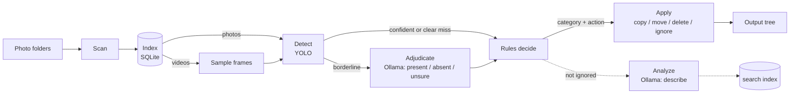
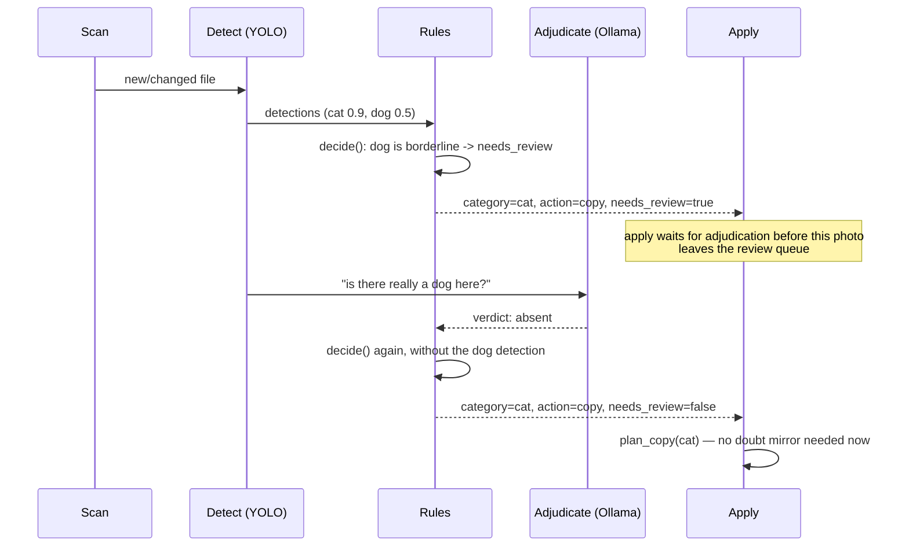

# Concepts

What mediasort does, the tools it leans on, and why the pipeline is shaped the
way it is. For "which file does this" see [ARCHITECTURE.md](ARCHITECTURE.md).

## The elevator pitch

Point mediasort at a folder of photos. It finds the ones containing whatever
*you* define — a cat, a dog, a person, a receipt, anything an object detector
can recognize — and does whatever *you* decide with them: copy into a folder,
move, delete, or leave alone. Videos in that folder are sorted the same way,
by what the detector finds in frames sampled across them. Everything runs on
your machine, against a detector and a vision model you already have
installed. Nothing leaves it.

Three ideas make that work:

1. A fast, narrow detector (**YOLO**) looks at every photo and says what
   objects it saw, with a confidence score.
2. A set of **rules you write** turns "what was seen" into "what to do about
   it" — no code, just a JSON file (or the built-in editor).
3. A slower, general vision model (**Ollama**) is called in only for the
   photos the detector could not decide on its own — either to double-check a
   borderline detection, or to write a free-text description for search.

## The shape of a run



Solid arrows are the path every photo takes. Dashed arrows are the **semantic
pass** — optional, and off to the side: it writes a description used by
`mediasort search`, and never changes where a photo ends up.

A video joins the same path one step later: it cannot be handed to the model
whole, so a handful of frames are sampled across it first and those go through
detection as an ordinary batch. Everything downstream — the rules, the review
flag, the actions — treats the result exactly like a photo's. See
[Videos](#videos).

The index (a local SQLite database) is what makes every stage resumable.
Every image has a small state machine per stage — pending, running, done,
error — so scanning, detecting, adjudicating and analyzing a library of
300,000 photos can be interrupted at any point and picked back up exactly
where it stopped, without redoing work. See
[ARCHITECTURE.md](ARCHITECTURE.md#the-index) for the actual schema.

## The detector: YOLO

[YOLO](https://github.com/ultralytics/ultralytics) ("You Only Look Once") is
an object detector: given an image, it draws boxes around things it
recognizes and names each one — `cat`, `dog`, `person`, `car`, … — with a
confidence score from 0 to 1. It is fast (real-time, even on modest
hardware) and narrow: it only knows the ~80 classes its weights were trained
on (or however many a custom model was trained for). It has no idea what a
"birthday party" is; it only knows objects.

mediasort loads one YOLO model and runs every photo through it in batches —
that batching, not the model itself, is most of the throughput. A whole
library's detection pass typically takes minutes, not hours. Videos go through
the same model, a few sampled frames at a time; see [Videos](#videos).

Two thresholds decide what a detection means:

```
0.0                review_confidence           confidence               1.0
 │────────────────────────│───────────────────────│──────────────────────│
   not detected               "maybe" — flagged        confident match
                               for a second opinion      (satisfies a rule)
```

- **At or above `confidence`** (default `0.65`): the detection is real as far
  as the rules are concerned. A rule asking for `{"class": "cat"}` matches.
- **Between `review_confidence` and `confidence`** (default `0.35`–`0.65`):
  YOLO half-saw something. The photo is flagged `needs_review` and, if the
  second opinion is enabled, escalated to Ollama.
- **Below `review_confidence`**: not seen at all, as far as anything
  downstream is concerned.

## Videos

A video is not a special kind of file here — it is a file YOLO reaches by a
different road. Eight stills (`MEDIASORT_DETECT_VIDEO_FRAMES`) are sampled
across its length and run through the model as one batch, and the video is
then sorted by what they showed. A clip of your cat lands in `Cat/` next to
the photos of it.

**Why sample rather than decode everything.** A three-minute clip at 30fps is
5,400 frames — running the detector on all of them would cost more than the
entire photo library. Eight is a bargain: enough to catch a subject that is
only in part of the clip, cheap enough that a video costs what eight photos
cost. The frames are taken at the *midpoint* of eight equal slices rather than
evenly from end to end, because the first and last frames of a real video are
disproportionately black, a fade, or a title card.

**Why one answer per file.** The index stores detections per file, and a video
is one row — so eight frames' worth of boxes have to collapse into one verdict.
Per class, the frame that saw the most of it wins, ties going to the more
confident frame:

- a maximum, not an average, because a dog that walks into shot halfway
  through is still a dog in that video, and averaging over the frames it is
  absent from would hide it;
- the busiest *frame*, not the best *box*, because counts have to survive.
  Keeping only the single strongest box per class would cap every video at one
  of everything, and a `min_count: 2` rule could never match one.

The cost of that choice: the box coordinates stored for a video belong to one
frame, not to the file, and a subject that appears only between two sampled
frames is missed entirely. Raise the frame count for long clips.

**The `video` class.** Every video also carries a `video` class, at confidence
1.0, on top of whatever the frames showed. No model looks for it — it is true
of the file by its extension — so a rule matching `{"class": "video"}` catches
any video at all. Rules are tried in order, which is what turns that into a
*fallback*: put the `video` rule below your real classes and the cat video
sorts as a cat while everything unrecognised still lands in `video/`; put it
at the top and every video sorts as a video, whatever is in it. Both are
legitimate, and the difference is one line of `rules.json`.

It is also the whole answer for a video nothing could look inside — a
container OpenCV will not open, a truncated download. That is not an error:
the file's extension is still true, so it sorts on that alone rather than
being parked in the error state.

Ollama sees a video as a single frame from halfway in, for both the second
opinion and the description pass. A real limitation for anything that only
makes sense in motion.

`MEDIASORT_DETECT_VIDEO_FRAMES=0` turns all of this off: videos are then
matched by extension alone, which is faster and blind.

## The second opinion: adjudication

Ollama's vision models are slower and much more general than YOLO — they can
be *asked* a question about an image, not just report fixed classes. mediasort
uses that for exactly one narrow job: for a photo with a borderline
detection, show it to Ollama and ask, in plain language, "is there really a
cat in this picture?" The model answers one of three things:

- **present** — promotes that class's best borderline box up to the decision
  threshold, so the rules see a real match. Only ever the *best* box: a
  verdict says the subject is there, not how many, so a rule requiring two
  cats still needs the detector to have actually found two.
- **absent** — drops the class. The photo stops being flagged for that class.
- **unsure** — changes nothing. An image nobody (neither model) could settle
  is exactly what the review folder is for.

A confident YOLO detection (at or above that class's `min_confidence`) is
never sent for a second opinion and never overruled by one — adjudication
exists to settle doubt, not to argue with certainty.

This pass is cheap because it only ever runs on the borderline slice of a
library, typically a small fraction of it, and only for classes whose rule
condition turns `ollama_review` on. Turn it off for a class — or leave it at
its default, since it defaults on — and a borderline photo of that class goes
straight to the review folder instead, the same behavior the tool had before
this pass existed. It is a per-class setting on the rule condition now, not a
single global switch.

## The rules engine

A rule is three things: a **name**, a **condition**, and an **action**.
Rules are evaluated top to bottom and the **first match wins**, so the most
specific rule goes first and a catch-all goes last.

```json
{ "name": "cat-dog", "when": {"all_of": ["cat", "dog"]}, "action": "copy" }
{ "name": "cat",     "when": {"class": "cat"},           "action": "copy" }
{ "name": "none",    "when": {"always": true},           "action": "ignore" }
```

A condition is a small composable tree — a class match (optionally requiring
a minimum count, its own confidence threshold, its own review-band floor, and
its own on/off switch for the second opinion), combined with `all_of` /
`any_of` / `none_of` / `not`, or the catch-all `always`. New operators are
added by writing one class, nothing else changes. The rules never know about
pixels or models — they only see what the detector (and, if it ran, the
second opinion) reported.

**Rules decide what the detector looks for, not the other way around.** The
detector is asked only for classes at least one rule mentions, and the
semantic pass only describes those same classes. Add `bird` to a rule and
mediasort asks YOLO for `bird` and Ollama for `bird_count`/`bird_kinds` —
there is no second list to keep in sync.

**Rules run twice** for any photo that gets a second opinion: once right
after detection (which is enough to decide most photos immediately), and
again after adjudication, using whatever the verdict changed. A rule edit
alone triggers neither model — `mediasort recheck` replays the *stored*
detections and verdicts against the current rules, instantly and without a
GPU, which is why editing a rule is cheap to try.

## The one rule you cannot delete: doubt

A photo YOLO could not settle, and that no second opinion resolved either
(or that had none enabled), still needs a place to go. That is the **doubt
rule** — always present, always evaluated last, not part of the ordinary
match race above. It answers a different question than every other rule:
not "what was seen", but "was anyone sure?"

By default it **moves** the photo into a `_Review` folder — the one action
`delete` is deliberately never allowed to be, so an uncertain photo can never
be thrown away unattended. If the matched ordinary rule's action leaves the
original in place (`copy`), the review copy sits alongside it, not instead of
it; if the ordinary rule's action would consume the original (`move`,
`delete`), the review copy takes the photo and the ordinary action is skipped
— a photo nobody could settle has not earned a place in a category folder.

## The actions

Four actions ship with the tool, and each is named for exactly what it does —
there is no separate setting that changes what "copy" secretly means:

| Action   | Does to the original          | Tracked & pruned |
| -------- | ------------------------------ | ----------------- |
| `copy`   | nothing — a duplicate is made  | yes |
| `move`   | relocates it                   | no (it *is* the output) |
| `delete` | relocates it into the trash folder — always recoverable | no |
| `ignore` | nothing at all                 | — |

Applying rules is **idempotent**: running `apply` again after nothing
changed produces nothing new, and if a rule edit means a photo no longer
belongs in a folder it used to be copied into, the stale copy is removed
automatically (a `move`d or `delete`d original is never "pruned" back —
those are gone by definition).

## The semantic pass: search

Independent of everything above, Ollama can also be asked to just *describe*
a photo it was already sorted into a category — how many of the subject,
what kind/breed, what they're doing, indoor or out, a quality score. That
goes into the index purely so `mediasort search "maine coon"` can find it
later; no rule ever depends on it, and it always runs — there is no switch
for it. It is also the slowest pass by far — one Ollama request per photo,
seconds each — so a first pass over a large library commonly runs detection
only (`mediasort run --no-analyze`), then analysis later or in the
background.

## One photo's journey


